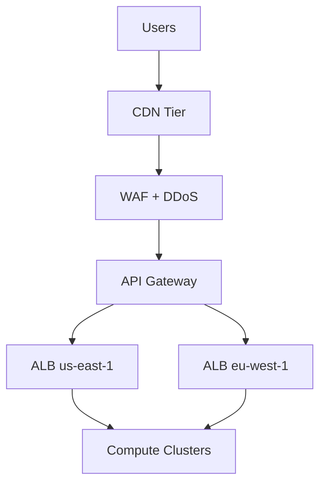
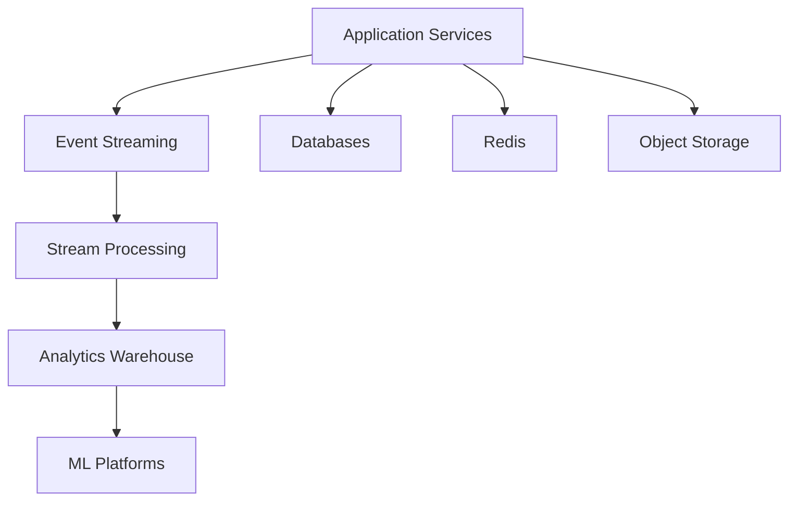
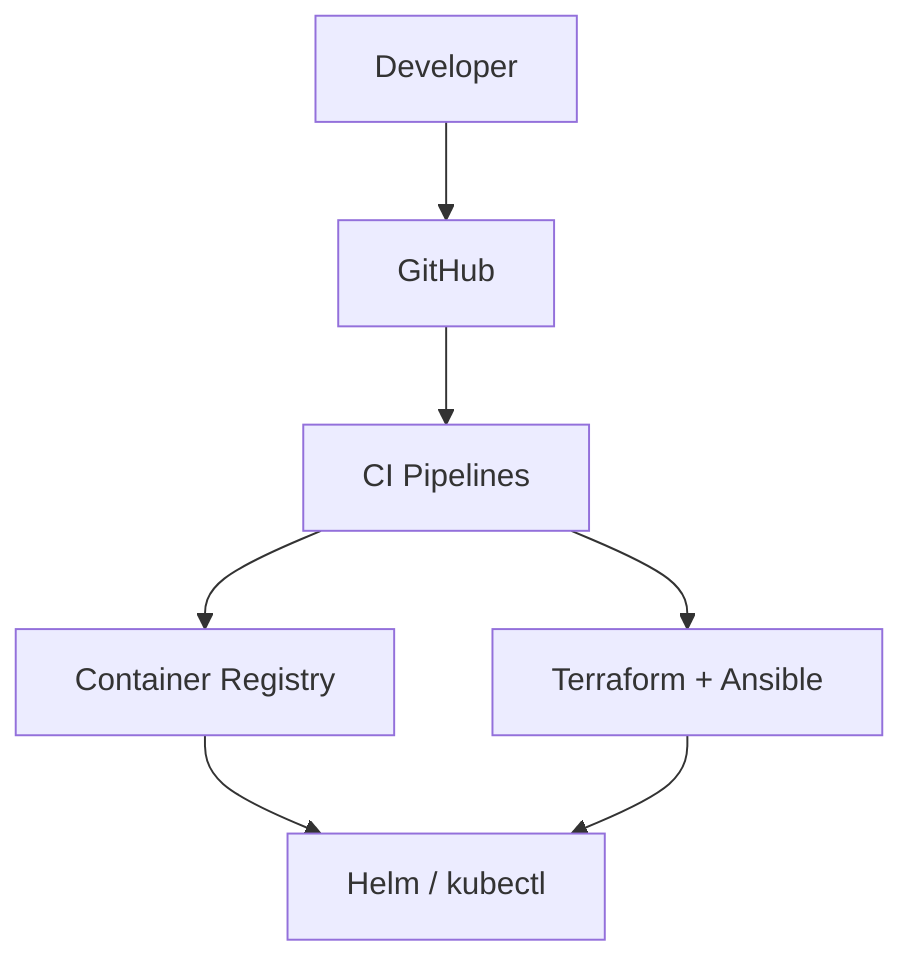
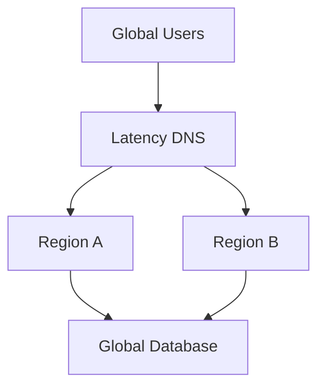
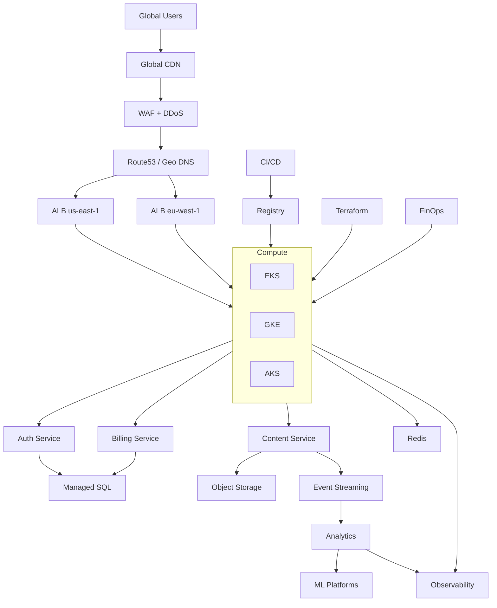

# 🌐 Cloud-Native Streaming Platform & 🌍 Production-Hardened AWS Platform

**Unified Multi-Cloud + AWS Global Architecture Blueprint**

> Enterprise-grade, Netflix-style reference architecture  
> Built for **global scale, real-time workloads, security, resilience, and compliance**

---

## 🚀 Executive Overview

This repository delivers a **complete production architecture** that combines:

- **Multi-Cloud Streaming Platform** (AWS, GCP, Azure)
- **Production-Hardened AWS Global Platform** (Netflix-style multi-region)

It is designed for teams that **expect failure**, operate under **compliance constraints**, and require **zero-downtime delivery**.

---

## 🧱 Architecture Views (Separated by Concern)

This document includes:
1. Runtime Architecture
2. Data & Analytics Architecture
3. CI/CD & Infrastructure Architecture
4. Active-Active Global Variant
5. **Single Unified Architecture (Full System)**

---

# 🟦 1. Runtime Architecture

---

# 🟩 2. Data & Analytics Architecture

---

# 🟨 3. CI/CD & Infrastructure Automation

---

# 🟥 4. Active-Active Global Traffic

---

# 🟪 5. FULL UNIFIED ARCHITECTURE (END-TO-END)

---

## 📊 Compliance Mapping

| Control | SOC2 | ISO | PCI |
|------|------|-----|-----|
| IAM | ✔ | ✔ | ✔ |
| Encryption | ✔ | ✔ | ✔ |
| Logging | ✔ | ✔ | ✔ |
| DR | ✔ | ✔ | ✔ |
| Network Segmentation | ✔ | ✔ | ✔ |

---

## 💼 Credits

**Architecture Design**  
Ankur Chouhan — Alien LLC / YFS Entertainment

📧 ankurchouhan@yfsentertainment.com  
🌐 https://www.yfsentertainment.com

---

## ⚖️ License

MIT License © 2025 Ankur Chouhan / Alien LLC
