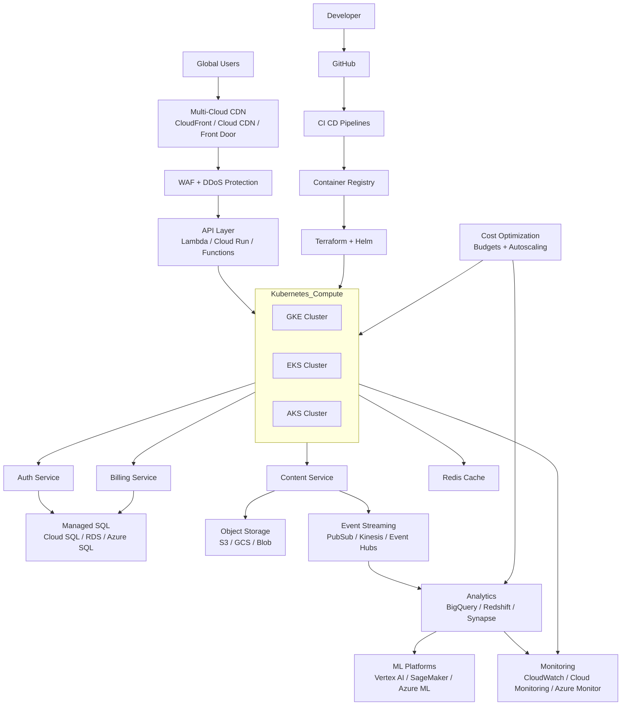

# 🌐 Cloud-Native Streaming Platform
**Multi-Cloud Compute + Serverless + Data + CI/CD + Cost Optimization**

> **Enterprise-grade, production-ready, multi-cloud architecture**
> Inspired by Netflix / YouTube patterns — engineered for startups to Fortune-500 scale.

---

## 🚀 Executive Overview

This repository showcases a **production-grade, cost-optimized streaming platform** designed for **AWS, GCP, and Azure**.

It demonstrates how to build a **real-time, video-on-demand and analytics system** using containers, serverless workloads, event-driven pipelines, and fully automated CI/CD.

**One repository. Three clouds. Full automation.**

---

## 📐 Unified Multi-Cloud Architecture Diagram

> ✅ Fixed Mermaid syntax — renders correctly on GitHub



---

## 🏗️ System Layers

| Layer | Purpose | Technologies |
|-----|--------|-------------|
| Edge & CDN | Global delivery | CloudFront, Cloud CDN, Front Door |
| API | Stateless endpoints | Lambda, Cloud Run, Functions |
| Compute | Microservices | EKS, GKE, AKS |
| Data | Storage & cache | SQL, Redis, Object Storage |
| Analytics | Streaming pipelines | PubSub, Kinesis, Event Hubs |
| ML | Recommendations | Vertex AI, SageMaker |
| Observability | Metrics & logs | Prometheus, Grafana, ELK |
| Automation | IaC & config | Terraform, Ansible |
| CI/CD | Delivery | GitHub Actions, Cloud Build |
| FinOps | Cost control | Budgets, autoscaling |

---

## 🔄 CI/CD Workflow

1. Developer pushes code
2. CI builds & tests
3. Images pushed to registry
4. Terraform provisions infrastructure
5. Helm deploys services
6. Canary or rolling updates
7. Metrics validate rollout

---

## 💰 Cost Optimization Strategy

- Spot and preemptible nodes
- Aggressive autoscaling
- Storage lifecycle policies
- Automated cleanup of idle resources
- Budget alerts and dashboards

Typical savings: **30–70%**

---

## 🧪 Chaos Engineering

- Kill pods and services
- Disable zones
- Inject latency
- Force database failovers
- Validate SLO recovery

---

## 📁 Repository Structure (Simplified)

```text
streaming-platform/
├─ frontend/
├─ backend/
├─ infrastructure/
│  ├─ terraform/
│  ├─ ansible/
│  ├─ kubernetes/
│  └─ ci-cd/
├─ data/
├─ docs/
└─ README.md
```

---

## 💼 Credits & Professional Use

**Original Architecture Design:**  
**Ankur Chouhan / Alien LLC / YFS Entertainment**

📧 ankurchouhan@yfsentertainment.com  
🌐 https://www.yfsentertainment.com

---

## ⚖️ License & Attribution

MIT License © 2025 Ankur Chouhan / Alien LLC

Attribution required for commercial or production use.
Unauthorized redistribution or misrepresentation is prohibited.

